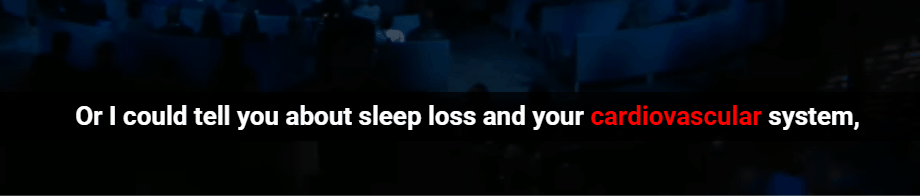

# YouTube Dual Subtitle Helper

A lightweight Chrome extension for learning English while watching YouTube — without interrupting playback.

---

## ✨ Features

* 🎬 Custom subtitles overlay on YouTube
* 🔍 Highlight important words and phrases
* 🧠 Hover to instantly see meanings (no pause needed)
* 🎯 Minimal UI for distraction-free learning
* ⚡ Fast and lightweight compared to heavy tools

Currently optimized for Japanese learners (Japanese translations included).
---

## 💡 Concept

> Stop pausing videos. Understand while watching.

Most language learners struggle with:

* Pausing videos repeatedly
* Looking up words manually
* Losing focus during learning

This extension solves that by showing meanings instantly on hover, allowing continuous and natural learning.

---

## 🛠️ Tech Stack

* TypeScript
* React (for popup)
* Chrome Extension (Manifest V3)
* DOM manipulation

---

## 🚀 How It Works

1. Captures YouTube subtitles
2. Detects important words and phrases
3. Highlights them in real-time
4. Shows meanings on hover

---

## ⚙️ Installation

1. Clone this repository
2. Run:

   ```
   npm install
   npm run build
   ```
3. Open Chrome Extensions
4. Enable Developer Mode
5. Load the `dist` folder

---

## 📌 Future Improvements

* Save words for review
* Pronunciation feature
* Better NLP-based phrase detection
* UI customization options

---

## 🤔 Why I Built This

I wanted a simpler and more focused alternative to existing tools.

Instead of adding many features, I focused on:

* Speed
* Simplicity
* Learning efficiency

---

## 📷 Demo


---

## 📚 Dictionary Data

The dictionary data is **not included** in this repository due to licensing reasons.

Please prepare your own dataset and add it.

---

### 📂 Dictionary Setup

This extension uses two separate dictionaries:

- `assets/wordDict.json` → single words (highlighted in **red**)
- `assets/PhraseDict.json` → phrases (highlighted in **blue**)

Please provide your own data in the following format:

```json
{
  "run": { "ja": "走る" },
  "take off": { "ja": "離陸する" }
}

---

## 📄 License

MIT
